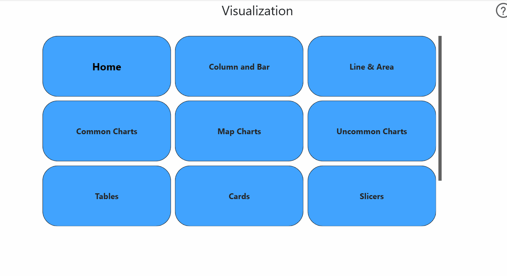
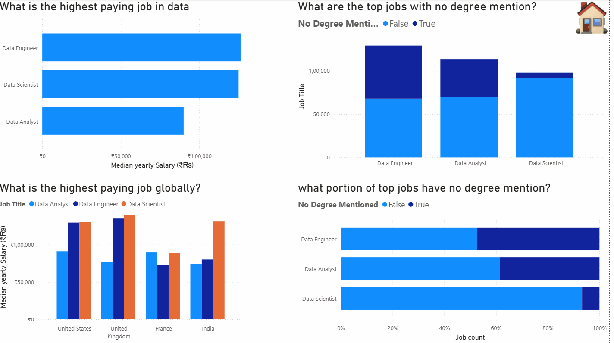
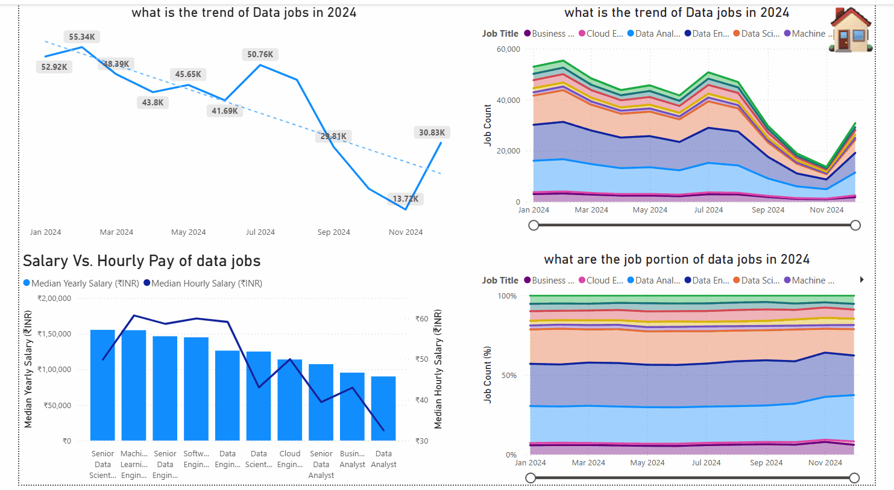
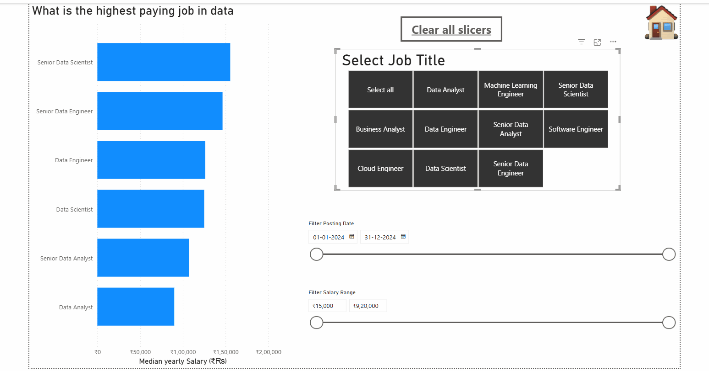
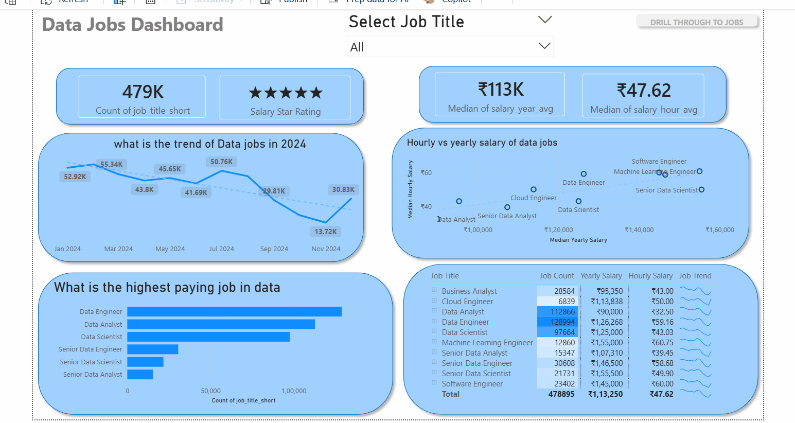

# 📊 Data Jobs Dashboard (Power BI)

> 🚀 An interactive Power BI dashboard analyzing the **2024 data job market**, including salary trends, job demand, and hiring patterns.

---

## 🔍 Problem Statement

Understanding the data job market is difficult because information is scattered across multiple platforms.

This project solves that problem by providing a **centralized, interactive dashboard** that helps:

- 👨‍💻 Job Seekers
- 🔄 Career Switchers
- 📈 Professionals

make **data-driven career decisions**.

---

## 🎯 Project Objectives

- Analyze **salary trends** across data roles
- Identify **high-demand job titles**
- Explore **job distribution globally**
- Understand **degree requirements & WFH trends**
- Provide an **interactive experience** using Power BI

---

## 🛠️ Tools & Technologies

- 📊 Power BI
- 🧮 DAX (Data Analysis Expressions)
- ⚙️ Power Query (ETL)
- 📁 CSV Dataset

---

## 📁 Dataset

Due to GitHub file size limitations, the full dataset cannot be uploaded directly.

🔗 **Download Full Dataset:** [Click Here](https://drive.google.com/file/d/1fMS0pM-52hbebP4q_wTdz74B_HOslmLa/view?usp=sharing)

---

## 📊 Dashboard Features

### 🔹 1. Overview Dashboard

- 📌 Total job count
- 💰 Median salary insights
- 📊 Top job roles

---

### 🔹 2. Salary Analysis

- 💰 Salary comparison across roles
- 📊 Yearly vs hourly salary
- 📈 Job count distribution

---

### 🔹 3. Trends Analysis

- 📈 Monthly hiring trends
- 📊 Job demand fluctuations

---

### 🔹 4. Interactive Filters (Slicers)

- 🎯 Filter by job title
- 💰 Filter by salary range
- 📅 Filter by date

---

### 🔹 5. Drill-Through Analysis

- 🔍 Deep dive into specific job roles
- 📊 Detailed salary insights
- 🌍 Job distribution

---

## 📈 Key Insights

- 💰 **Data Engineer** and **Data Scientist** are among the highest-paying roles
- 📊 Majority of jobs are **full-time (~90%)**
- 🎓 Around **33% jobs don’t require a degree**
- 🏠 Work-from-home jobs are limited (~13%)
- 📉 Job demand fluctuates across months

---

## 📌 Project Impact

This dashboard helps users:

- Identify high-paying roles in the data industry
- Understand hiring trends across time
- Make better career decisions using data insights

## 🚀 How to Use

1. Download the `.pbix` file
2. Open in **Power BI Desktop**
3. Use slicers and filters to explore insights

---

## 💡 Why This Project Stands Out

- ✅ Real-world dataset
- ✅ End-to-end data analysis
- ✅ Interactive dashboard design
- ✅ Multiple visualizations
- ✅ GIF-based demonstration (rare & impressive)

---

## 📌 Future Improvements

- 🔮 Add predictive analytics (forecasting trends)
- 🌐 Deploy dashboard on Power BI Service
- 📊 Integrate real-time data

---

## ⭐ Support

If you found this project useful:

- ⭐ Star this repository
- 🔗 Share it with others
- 💼 Add it to your portfolio

---

## 👨‍💻 Author

**Arpan Pawar**

---
